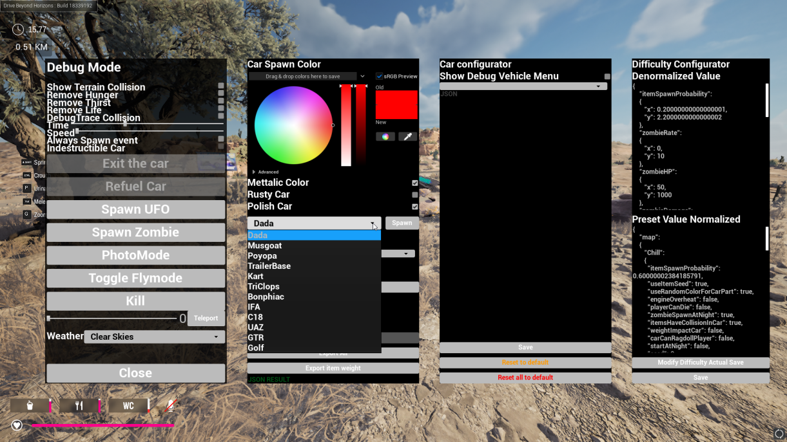

# DebugMenuMod Mod for Drive Beyond Horizons

This mod allows you to enable the Debug Menu in-game.



## Features

- Spawn any vehicle in the game with any finish, color, and quality.
- Fine tune vehicle settings.
- Spawn zombies, change the weather, or buff your stats.
- Spawn (almost) any item in the game.

## Usage

### Controls

- `F4` Displays the Debug Menu

## Tutorial Video

[](https://www.youtube.com/watch?v=pWbKwe9b0e0)

## Installation

Note: If you're installing an updated version of this mod, just overwrite the existing files.

1. Make sure you have the most recent `experimental-latest` version of UE4SS installed into your Drive Beyond Horizons directory. [Download](https://github.com/UE4SS-RE/RE-UE4SS/releases/tag/experimental-latest)
   
`Drive Beyond Horizons\DriveBeyondHorizons\Binaries\Win64`

2. Place the DebugMenuMod folder in your game's mods directory:
   
`Drive Beyond Horizons\DriveBeyondHorizons\Binaries\Win64\ue4ss\Mods\`

3. By default this mod will be enabled via enabled.txt in the mods folder. You can drop the mod in and and launch the game.

   There are two ways to enable/disable the mod:
   - **Method 1 (default)**: Create an empty file named `enabled.txt` in the DebugMenuMod folder
     - This bypasses the need to edit mods.txt/mods.json
     - To disable and use the next method, simply delete this file.
   - **Method 2**: Add the mod to your `mods.txt` and/or `mods.json` file in the UE4SS Mods directory:

   mods.txt:
     ```
     DebugMenuMod : 1
     ```
   mods.json:
     ```json
     {
       "DebugMenuMod": true
     }
     ```
4. Launch the game and load into a map
5. Press F4 in-game to open the Debug Menu

## Multiplayer

- Needs to be tested

## Known Issues

- Report issues here or message Logic on Discord: `gage.sh`

## Troubleshooting

If you encounter issues:

1. Check the UE4SS console for error messages (requires zDEV-UE4SS install)
2. Make sure the mod is properly installed and enabled (either with enabled.txt or in mods.txt/mods.json)

## TODO

--

## Credits

Special thanks to the UE4SS and Drive Beyond Horizons team for making modding possible.
